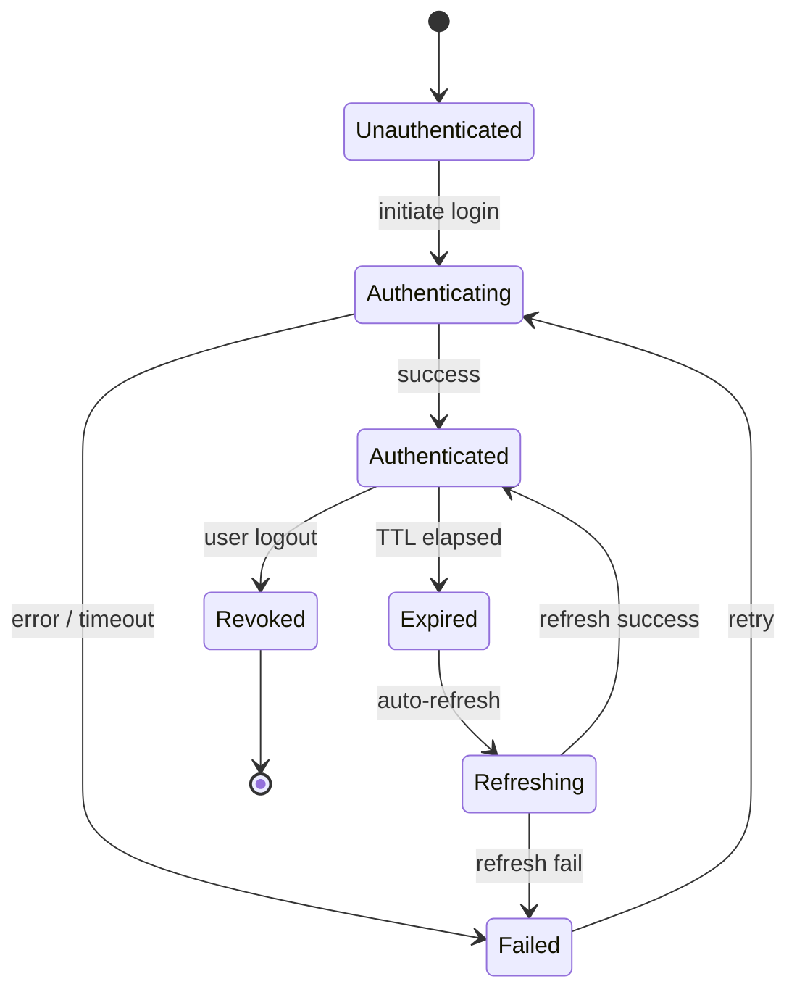

# ADR 016: Provider Session Lifecycle

## Status
**SUPERSEDED** — Phase B of the Genesis Migration removed the `AuthPlatform` session lifecycle manager upon which this ADR depended. The `ProviderSession` model itself remains in `app/core/provider_session.py`, but the full state machine, concurrency locks, and audit logging described here were never implemented. This ADR is superseded until Sprint 1 (Kairos Shell) defines a concrete session lifecycle. (2026-07-06)

## Context
ADR 015 introduced the `ProviderSession` abstraction to decouple credential validation from AI provider routing. To guarantee system stability, prevent security vulnerabilities (such as session hijacking or race conditions during token refreshes), and ensure clear debugging, we must formally define the lifecycle and state transitions of a `ProviderSession`.

## Decision
We will model the lifecycle of a `ProviderSession` as a strict, atomic state machine.

### 1. Session States
A `ProviderSession` will exist in one of the following seven states:

1.  **`Unauthenticated`**: No credentials or sessions are initialized for the user configuration.
2.  **`Authenticating`**: Transient state. The adapter is exchanging an OAuth authorization code or verifying an API key's validity against the provider's readiness/validation endpoint.
3.  **`Authenticated`**: Active state. The credentials have been successfully validated. The session is valid and ready to route inference requests.
4.  **`Expired`**: Passive/Transient state. The session's time-to-live (TTL) or token validity has expired, rendering it temporarily unusable.
5.  **`Refreshing`**: Transient state. The adapter is actively using a refresh token or workload identity exchange to obtain a new short-lived access token.
6.  **`Revoked`**: Terminal state. The session has been explicitly destroyed via user logout or remotely revoked by the vendor platform.
7.  **`Failed`**: Static error state. Authentication or token refresh failed due to invalid credentials, remote platform revocation, or terminal network issues.

---

### 2. State Transition Invariants
*   **Concurrency Locks:** While in the `Refreshing` state, any concurrent request requesting a refresh must block to prevent sending duplicate refresh tokens to OAuth endpoints (which often invalidates the refresh token chain).
*   **Fail-Safe Routing:** The `AIProviderRouter` will only dispatch calls to sessions in the `Authenticated` state. If a session is `Expired` or `Failed`, it must trigger validation/refresh or exclude the provider from routing attempts.
*   **Identity Pinning:** A session is bound to a single user identity and provider configuration and cannot be reassigned.

---

### 3. Persistence and Vault Isolation
*   **Session Database:** The session metadata (state, timestamps, expiration, and scopes) is persisted in a local database (e.g., SQLite for local-first deployments).
*   **Credential Isolation:** Opaque IDs and references are stored in the database. The actual secret tokens or keys reside in the system's encrypted credential vault, separated by strict process boundaries.

---

### 4. Failure Handling & Backoff
*   **Transient Network Failures:** If a token refresh fails due to a network timeout, the state transitions to `Failed`, and a backoff retry schedule is scheduled.
*   **Terminal Auth Failures:** A `401 Unauthorized` or token invalidation error from the provider immediately moves the session to `Failed` or `Revoked`, prompting the user to re-authenticate.

---

### 5. Audit Logging
Every state transition must be written to an audit log. The logs will capture:
*   Timestamp of transition
*   Session ID and Provider ID
*   Origin and destination states
*   Reason (e.g., "OAuth Token expired", "User logout", "Network Timeout")
*   **Strict Security Invariant:** Under no circumstances will plain-text credentials, tokens, or headers be written to logs.

## Consequences
*   **Positive:** Predictable system behavior. Centralized state control eliminates race conditions and transient auth bugs.
*   **Positive:** Enhanced visibility. Audit logs and explicit failure states simplify system debugging and user notifications.
*   **Negative:** Developers must implement lock management for transient states (`Refreshing`, `Authenticating`) to prevent credential collisions.
