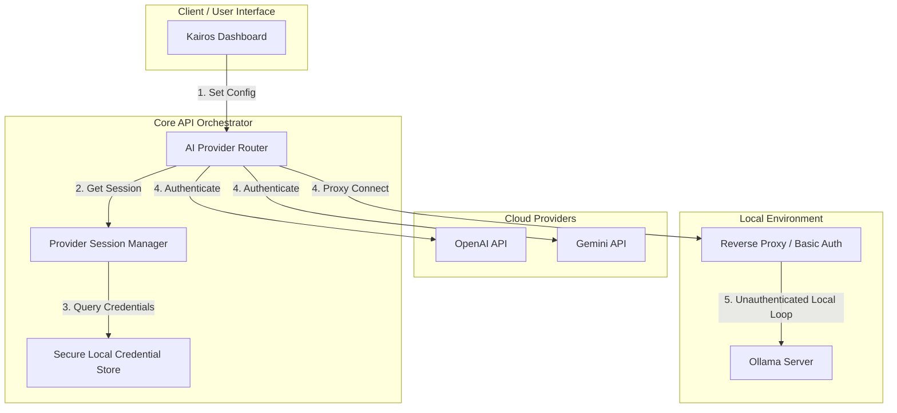

# Provider Authentication Research

> **SUPERSEDED** — Phase B of the Genesis Migration removed the `auth_platform` scaffold. The BYOK analysis and provider security profiles remain useful reference material, but the recommended architecture (session manager, credential store, proxy integration) referenced code that no longer exists. Revisit this research when designing auth for Kairos Shell in Sprint 1. (2026-07-06)

**Sprint 6 — Research & Architecture Document**

This document details the authentication models, limitations, security profiles, and recommended integration architecture for integrating primary AI providers (**OpenAI**, **Google Gemini**, and **Ollama**) into Kairos OS.

---

## 1. Provider Security & Authentication Profiles

### 1.1 OpenAI

#### Official Authentication Models
*   **API Key Authentication (Standard):** The primary official developer authentication method. Requests are authorized by providing an API key in the HTTP request header:
    `Authorization: Bearer <OPENAI_API_KEY>`
*   **Workload Identity Federation:** Supported for enterprise deployments where applications exchange short-lived tokens generated via cloud providers (GCP, AWS, Azure) rather than using static API keys.
*   **ChatGPT User login (Internal):** End-user login on `chatgpt.com` is managed via Auth0/OAuth2 protocols. This flow is proprietary and reserved for the first-party web UI and mobile clients.
*   **Codex CLI / Desktop Authentication:** Authenticates using interactive OAuth web consent that generates a localized token saved in `auth.json`. This links to the user's personal Plus/Enterprise subscription, but the underlying token format and endpoints are proprietary.

#### Limitations for Third-Party Apps
*   **No Delegated User Billing API:** OpenAI does not offer an official OAuth delegation flow that allows third-party applications (like Kairos) to execute standard API calls (GPT-4o inference, etc.) charged to an end-user's personal ChatGPT Plus subscription.
*   **Brittle Community Workarounds:** Any unofficial attempt to bypass login prompts using session cookies or browser automations violates OpenAI's Terms of Service, is easily broken by Cloudflare protection updates, and puts users at risk of permanent account bans.

---

### 1.2 Google / Gemini

#### Official Authentication Options
*   **Google AI Studio API Keys (Developer):** The standard method for developers integrating Gemini. API keys are generated via Google AI Studio and passed via request headers or query parameters:
    `x-goog-api-key: <API_KEY>`
*   **Google Cloud OAuth 2.0 (Vertex AI):** Targeted at enterprise deployments. Developers use OAuth 2.0 Client IDs, Service Accounts, or Workload Identity to request short-lived Google Cloud Access Tokens to invoke Vertex AI Gemini endpoints.
*   **Google Sign-In:** Used strictly for identity management (OIDC) to authenticate that a user owns a Google account. It does **not** grant authorization or API credits to call the Gemini API on the user's behalf.

#### Limitations for Third-Party Apps
*   **No Consumer Subscription Delegation:** Just like OpenAI, Google does not support a flow where an end-user logs into their personal "Gemini Advanced" Google Account to let a third-party app run model inference billed directly to that consumer subscription. Billing is always tied to the GCP project (for OAuth) or AI Studio account (for API keys) hosted by the developer.

---

### 1.3 Ollama

#### Authentication Profile
*   **Zero Built-in Authentication:** Ollama has no native user/password, token, or API key validation mechanism.
*   **Local Host Isolation:** By default, the service binds to `127.0.0.1:11434` (localhost), assuming only the host system can issue requests.

#### LAN Deployment Considerations
*   **Open Vulnerability:** Exposing Ollama to a local area network (LAN) by setting `OLLAMA_HOST=0.0.0.0` leaves the engine completely open. Anyone on the network can run prompts, view chat history, download large models, delete models, and saturate system memory/GPU resources.
*   **Need for Proxy Gateways:** Running Ollama securely in LAN/distributed environments requires putting a reverse proxy (e.g. Nginx, Caddy, Traefik) in front of the port to provide TLS, Basic Authentication, or token validation.

---

## 2. Supported Use Cases vs. Unsupported Assumptions

### Supported Use Cases
1.  **Bring-Your-Own-Key (BYOK):** End-users input their own OpenAI/Gemini developer API keys into the Kairos configuration. The user is directly billed by Google/OpenAI, and Kairos acts as a local orchestrator client.
2.  **Self-Hosted Local LLM (Ollama):** Running Ollama entirely on the local loopback (`127.0.0.1`), ensuring zero network exposure and zero authentication requirements.
3.  **Proxy-Secured Shared Local LLM:** Sharing an Ollama node across the LAN by protecting the connection with a lightweight proxy implementing Basic Auth.

### Unsupported Assumptions (Anticipated Failures)
*   *Assumption:* "Users can log in with their ChatGPT Plus or Gemini Advanced accounts and Kairos can call the API for free."
    *   **Reality:** Both platforms strictly separate consumer-facing chat web interfaces (paid via monthly consumer subscription) from programmatic developer APIs (paid via usage-based token consumption).
*   *Assumption:* "Google Sign-In will let Kairos execute Gemini models."
    *   **Reality:** Google Sign-In only establishes user identity. Calling Gemini requires a separate AI Studio API key or a fully configured GCP project using OAuth/Service Accounts.

---

## 3. Security Considerations

1.  **Key Storage Security:** BYOK setups require storing raw provider API keys locally. In Kairos, these must be kept in encrypted configuration stores or environment files (`.env`) rather than plain text DB fields.
2.  **Shared Network Exposure:** Any network-visible deployment of Ollama without reverse proxies is a high-risk security flaw.
3.  **Credential Exfiltration:** Storing credentials or session parameters inside client-side components increases exposure to local malware or cross-site scripting (XSS) attacks.

---

## 4. Recommended Kairos Architecture

To accommodate both local and cloud providers securely, Kairos should employ a hybrid credential model:

### Architectural Pillars
1.  **Decoupled Session Manager:** Keep the `ProviderSession` architecture backend-driven. The router queries the session manager, which extracts keys from the local secure environment storage.
2.  **Encrypted Local Credential Store:** Use system-level keyring tools or environment variables protected by file permissions for local keys.
3.  **Reverse Proxy Integration for Ollama:** Ensure Kairos automatically configures a lightweight reverse proxy or firewall rules when Ollama is shared across LAN networks.

---

## 5. Risks & Mitigation

| Risk | Impact | Mitigation |
| :--- | :--- | :--- |
| **API Key Leakage (BYOK)** | High (Financial/Privacy Loss) | Store keys in server-side environment configurations or encrypted files. Never expose keys to the dashboard frontend. |
| **LAN Abuse of Ollama** | Medium (GPU/Compute Theft) | Default Ollama configurations to `127.0.0.1`. Provide automated proxy configuration if external access is requested. |
| **Unofficial Flow Deprecation** | High (Broken Integrations) | Avoid all unofficial, non-API endpoints or ChatGPT web-scraping wrappers. Rely strictly on official API routes. |

---

## 6. Migration Path (To Multi-Tenant OAuth)

When Kairos scales to support managed cloud/multi-tenant platforms, the authentication model must migrate from BYOK to OAuth-delegated access:

1.  **Phase 1 (Current - BYOK):** Direct local storage of user-provided API keys (OpenAI / Gemini) and local localhost loopback connectivity (Ollama).
2.  **Phase 2 (Cloud Relay):** Introduce a Kairos Managed Gateway. Users authenticate with the Kairos platform, which handles API billing and routes requests using OAuth tokens or GCP Service Accounts, isolating end-users from direct key management.
3.  **Phase 3 (Enterprise SSO):** Add OIDC (Google Sign-In, Okta) for identity federation, linking user access rights to specific enterprise-scoped API keys and tenant limits.

---

## 7. Strategic Recommendations

1.  **Enforce BYOK Model for Cloud Providers:** Standardize on OpenAI and Google AI Studio API key configurations for cloud-based routing. Instruct users clearly on how to obtain and secure these keys.
2.  **Deprecate Non-API Sign-Ins:** Do not attempt to implement or support ChatGPT/Gemini web client scraping or unofficial session cookie bypasses.
3.  **Local Ollama Default Binds:** Explicitly restrict Ollama integrations to `localhost` by default. Provide structured documentation on how to configure an Nginx proxy if LAN access is required.
